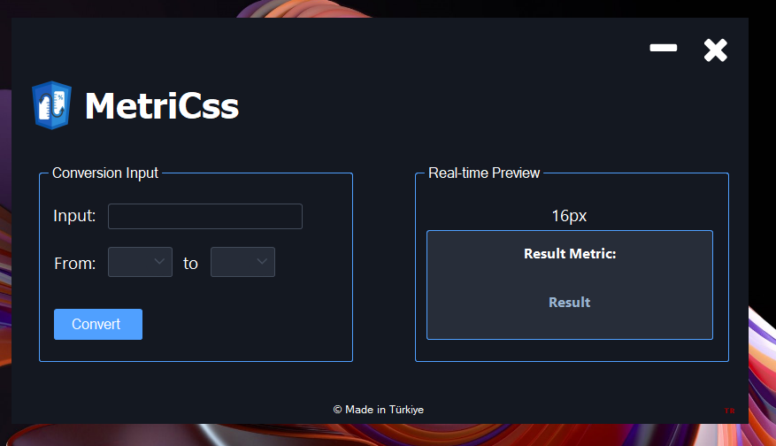

# MetriCss 📐

[English](#english) | [Türkçe](#türkçe)

---

## English

### 📌 About the Project
MetriCss is a lightweight C# WinForms desktop application designed to quickly and accurately convert CSS measurement units (especially `px` to flexible units like `%`, `rem`, `em`).

### 💡 The Backstory (Why This Program?)
While working on web design and responsive development, **I realized that I frequently fell into the trap of using static `px` (pixels) for everything.** This made it difficult for sites to be truly fluid across different screen sizes. To overcome this bad habit and speed up my front-end workflow, I built this tool to act as a quick-reference guide for instant metric conversion.

### 🛠️ Development Process & Credits
This project stands as a key piece of my professional portfolio. The development journey was as follows:
* **Design & UI:** The entire user interface, layout, UX, and aesthetic concept were **100% self-designed and crafted by me**.
* **Coding & Implementation:** In terms of writing the codebase, **10% relies on my own coding knowledge, and 90% was achieved through the guidance and assistance of Claude Code.**

---

## Türkçe

### 📌 Proje Hakkında
MetriCss, web tasarım süreçlerinde CSS ölçü birimlerini (özellikle `px` birimini `%`, `rem`, `em` gibi esnek birimlere) hızlı ve doğru bir şekilde dönüştürmek için tasarlanmış hafif bir C# WinForms masaüstü uygulamasıdır.

### 💡 Çıkış Hikayesi (Neden Bu Program?)
Web geliştirme ve responsive (uyumlu) tasarım üzerinde çalışırken, elementleri boyutlandırırken sık sık sadece **`px` (piksel) kullanma hatasına düştüğümü fark ettim.** Bu durum sitelerin farklı ekran boyutlarında esnek olmasını zorlaştırıyordu. Hem bu hatamın önüne geçmek hem de front-end süreçlerimi hızlandırmak amacıyla, ölçü birimleri arasında anında dönüşüm yapabilen bu rehber programı yazmaya karar verdim.

### 🛠️ Geliştirme Süreci & Katkılar
Bu proje benim profesyonel portfolyomun ilk parçalarından biridir. Geliştirme aşaması şu şekilde ilerlemiştir:
* **Tasarım & UI:** Programın tüm arayüz tasarımı, kullanıcı deneyimi (UX) ve görsel planlaması **tamamen benim tarafımdan** bağımsız olarak yapıldı.
* **Kodlama & Geliştirme:** Kod tabanının oluşturulmasında **%10 kendi kodlama bilgimden, %90 ise yapay zeka asistanı Claude Code'un** güçlü rehberliğinden ve optimizasyon desteğinden yararlandım.

---

